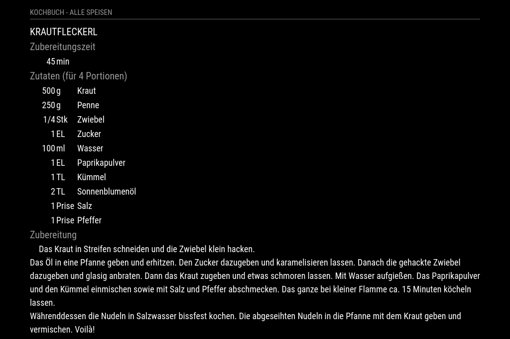
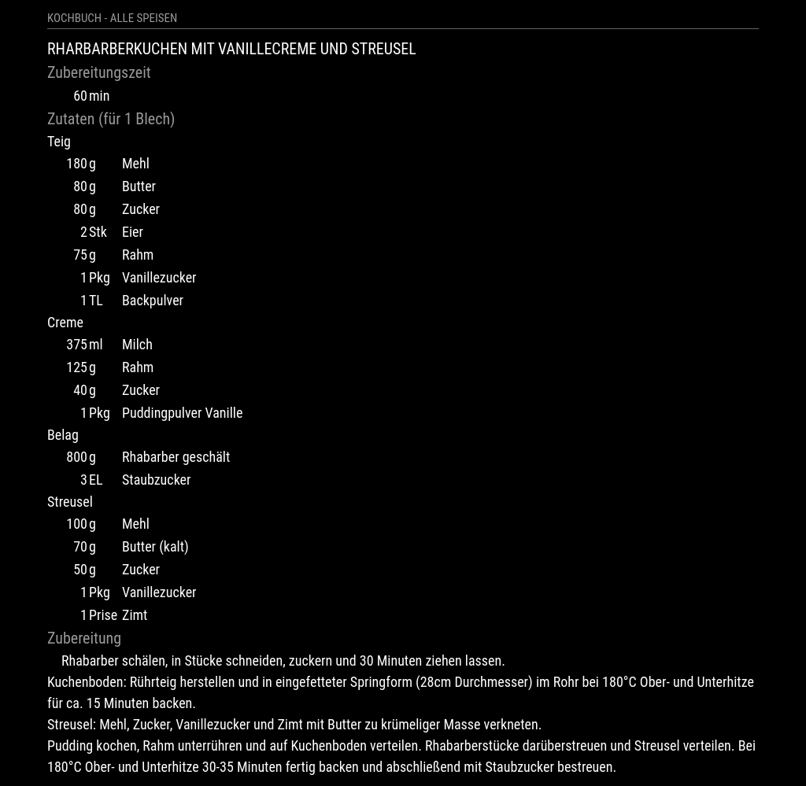

# MMM-Cookbook
This is an extension for the [MagicMirror](https://github.com/MichMich/MagicMirror). It displays recipes stored in a directory on a local drive.

## Screenshots

<br>*Exemplary recipe (simple style)*
<br>*Exemplary recipe (advanced style)*

## Installation

Navigate into your MagicMirror's `modules` folder and execute `git clone https://github.com/Strifus/MMM-Cookbook.git`.

## Using the module

To use this module, add it to the modules array in the `config/config.js` file:
````javascript
modules: [
	{
		module: 'MMM-Cookbook',
		config: {
			// See 'Configuration options' for more information.
		}
	}
]
````

At startup the module scans the specifed directory for recipes stored as *.json files and creates an internal list. Initially, the first recipe in the list will be displayed. To display the next recipe in the list, the notification `MMM-Cookbook_GET_JSON_NEXT` has to be sent. With the notification `MMM-Cookbook_GET_JSON_PREV` the preceding recipe in the list will be displayed.

## Configuration Options

The following properties can be configured:

<table width="100%">
	<thead>
		<tr>
			<th>Option</th>
			<th width="100%">Description</th>
		</tr>
	<thead>
	<tbody>
		<tr>
			<td><code>url</code></td>
			<td>Path to directory containing the recipes.<br>
			    <b>Default value:</b> <code>modules/MMM-Cookbook/recipes/</code>
			</td>
		</tr>
	</tbody>
</table>

## Example

To use this module, add it to the modules array in the `config/config.js` file:
````javascript
modules: [
    {
        module: 'MMM-Cookbook',
        header: 'Kochbuch - Alle Speisen',
        position: 'bottom_left',
        config: {
            // absolute path to directory with recipes:
            url: '/home/pi/Recipes/'
            // or relative path:
            //url: '../Recipes/'
            // default would be:
            //url: 'modules/MMM-Cookbook/recipes/'
        }
    },
]
````

## Format of json file

### Simple style recipe
````javascript
{
  "name": "Name of recipe",
  "size":
  {
    "value": "4",
    "unit": "Portions"
  },
  "time":
  {
    "value": "45",
    "unit": "min"
  },
  "ingredients":
  [
  {
    "name": "Name of ingredient 1",
    "value": "500",
    "unit": "g"
  },
  {
    "name": "Name of ingredient 1",
    "value": "250",
    "unit": "ml"
  },
  {
    "name": "...",
    "value": "1/4",
    "unit": "Piece"
  }
  ],
  
  "preparation":
  [
  {"step": "Description of preparation step 1"},
  {"step": "Description of preparation step 2"},
  {"step": "..."}
  ]
}
````
An exemplary recipe in the simple style format can be found in directory `MMM-Cookbook/recipes/`.

### Advanced style recipe
````javascript
{
  "name": "Name of recipe",
  "size":
  {
    "value": "4",
    "unit": "Portions"
  },
  "time":
  {
    "value": "45",
    "unit": "min"
  },
  "parts":
  [
  {
    "name": "Name of part 1 of recipe",
    "ingredients":
    [
    {
        "name": "Name of ingredient 1.1",
        "value": "180",
        "unit": "g"
    },
    {
        "name": "Name of ingredient 1.2",
        "value": "80",
        "unit": "g"
    }
    ]
  },
  {
    "name": "Name of part 2 of recipe",
    "ingredients":
    [
    {
        "name": "Name of ingredient 2.1",
        "value": "375",
        "unit": "ml"
    },
    {
        "name": "Name of ingredient 2.1",
        "value": "125",
        "unit": "g"
    }
    ]
  }
  ],
  
  "preparation":
  [
  {"step": "Description of preparation step 1"},
  {"step": "Description of preparation step 2"},
  {"step": "..."}
  ]
}
````

The MIT License (MIT)
=====================

Copyright © 2022 Strifus

Permission is hereby granted, free of charge, to any person
obtaining a copy of this software and associated documentation
files (the “Software”), to deal in the Software without
restriction, including without limitation the rights to use,
copy, modify, merge, publish, distribute, sublicense, and/or sell
copies of the Software, and to permit persons to whom the
Software is furnished to do so, subject to the following
conditions:

The above copyright notice and this permission notice shall be
included in all copies or substantial portions of the Software.

**The software is provided “as is”, without warranty of any kind, express or implied, including but not limited to the warranties of merchantability, fitness for a particular purpose and noninfringement. In no event shall the authors or copyright holders be liable for any claim, damages or other liability, whether in an action of contract, tort or otherwise, arising from, out of or in connection with the software or the use or other dealings in the software.**
